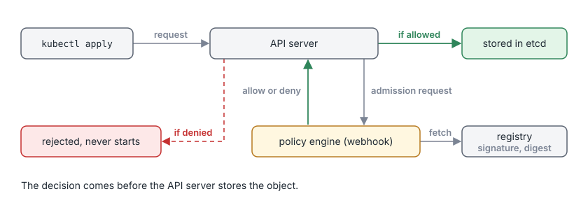
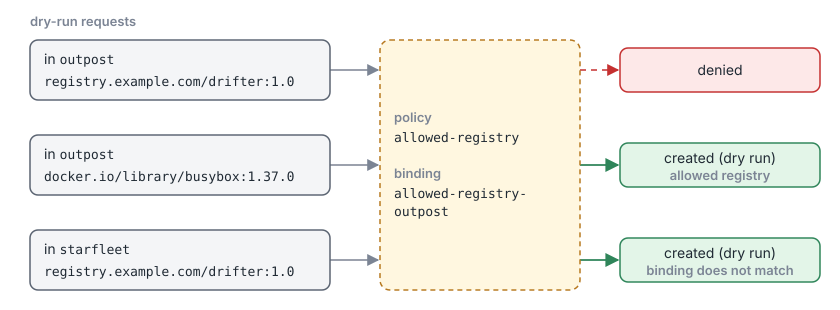

# SBOMs And Admission-Time Verification

Knowing which image runs is one question. Two more questions remain: what is inside the image, and how do you stop an unverified image from starting at all? A pinned digest answers neither.

This page describes the software bill of materials, and the checks a cluster can make when an object is created. Signature checks at that point need a policy engine, which the playground does not install. The API server can still check the image reference itself, and you build such a check in the playground.

## What an SBOM lists

A software bill of materials (SBOM) is a list of the components inside an artifact, in a form that programs can read. It names the packages and libraries, their versions, and often their licenses and sources. Two common formats are SPDX and CycloneDX.

A scanner can compare the list with a database of known vulnerabilities. So when a new vulnerability is published, you search your SBOMs instead of unpacking every image.

An SBOM is a statement made by whoever produced it. A list generated at build time from the build inputs can be wrong or incomplete, and a list that is not signed can be replaced. For that reason, an SBOM is often attached to an image as a signed attestation. An attestation is a signed statement bound to the image digest. Verifying the signature on the attestation, and the digest it names, is what links the list to the image.

## Verification at admission

An SBOM and a signature only help if something checks them before a pod starts. The Kubernetes API server runs admission control before it stores an object. Admission control is a set of checks that can accept or refuse each request to create or change an object.

Two kinds of admission check can refuse a Pod whose image breaks a rule:

- A validating admission webhook, where the API server sends the request to an outside service and waits for its answer.
- A ValidatingAdmissionPolicy, where the API server evaluates a rule itself.

Policy engines such as Kyverno or the Sigstore policy controller run as webhooks. They implement rules such as "every image must have a valid signature from this key or identity, and must be referenced by digest". When the rule fails, the API server rejects the Pod at creation, before any container starts.



The drawing shows the policy engine deciding before the API server stores the object in etcd, the database of the cluster.

For the check to mean something, the policy must meet four conditions:

- It requires the digest form, because a tag could resolve to another image after the check.
- It states the expected key, or the expected identity and issuer, as in keyless signing.
- The webhook fails closed, so an outage of the webhook does not let unverified images in.
- The exemptions, such as system namespaces, are small and reviewed.

## A rule inside the API server

A full signature check needs a webhook, but a simpler rule can run inside the API server. A ValidatingAdmissionPolicy is a Kubernetes object that holds a rule written in CEL (the Common Expression Language). The API server evaluates the rule itself, so no webhook and no extra component are involved.

A ValidatingAdmissionPolicyBinding is a second object. It says which requests the rule applies to, and what the API server does when the rule fails. CEL cannot fetch a signature from a registry, so this kind of policy checks only what the request contains, such as the text of each image reference.

The example policy below allows only images from `docker.io/library/`. Its `matchConstraints` select Pod requests, and the expression must be true for every container. `failurePolicy: Fail` makes the API server refuse the request if the expression cannot be evaluated. Save this as `validatingadmissionpolicy-allowed-registry.yaml`:

<!-- astrona:playground:renew -->

```yaml
apiVersion: admissionregistration.k8s.io/v1
kind: ValidatingAdmissionPolicy
metadata:
  name: allowed-registry
spec:
  failurePolicy: Fail
  matchConstraints:
    resourceRules:
    - apiGroups: [""]
      apiVersions: ["v1"]
      operations: ["CREATE", "UPDATE"]
      resources: ["pods"]
  validations:
  - expression: "object.spec.containers.all(c, c.image.startsWith('docker.io/library/'))"
    message: "every container image must come from docker.io/library/"
```

Apply it:

```sh
kubectl apply -f validatingadmissionpolicy-allowed-registry.yaml
```

```text
validatingadmissionpolicy.admissionregistration.k8s.io/allowed-registry created
```

The policy has no effect yet, because the API server enforces a policy only through a binding. The binding below applies the rule to the `outpost` namespace only. Every namespace carries the label `kubernetes.io/metadata.name` with its own name, so the selector matches exactly one namespace. `validationActions: ["Deny"]` makes a failed rule reject the request. Save this as `validatingadmissionpolicybinding-allowed-registry.yaml`:

```yaml
apiVersion: admissionregistration.k8s.io/v1
kind: ValidatingAdmissionPolicyBinding
metadata:
  name: allowed-registry-outpost
spec:
  policyName: allowed-registry
  validationActions: ["Deny"]
  matchResources:
    namespaceSelector:
      matchLabels:
        kubernetes.io/metadata.name: outpost
```

Apply it:

```sh
kubectl apply -f validatingadmissionpolicybinding-allowed-registry.yaml
```

```text
validatingadmissionpolicybinding.admissionregistration.k8s.io/allowed-registry-outpost created
```

Now test the rule without creating anything. `--dry-run=server` sends the request through admission control, and then the API server discards it. Wait a few seconds after you apply the binding. Then ask for a test pod `drifter-check` with an image from another registry, in `outpost`. The name differs from the `drifter` pod that already runs there:

```sh
kubectl -n outpost run drifter-check --image=registry.example.com/drifter:1.0 --dry-run=server
```

```text
The pods "drifter-check" is invalid: : ValidatingAdmissionPolicy 'allowed-registry' with binding 'allowed-registry-outpost' denied request: every container image must come from docker.io/library/
```

The API server rejected the request, and it named the policy, the binding and the message. The same request with an allowed image passes, and so does the same request in the `starfleet` namespace:

```sh
kubectl -n outpost run drifter-check --image=docker.io/library/busybox:1.37.0 --dry-run=server
kubectl -n starfleet run drifter-check --image=registry.example.com/drifter:1.0 --dry-run=server
```

```text
pod/drifter-check created (server dry run)
pod/drifter-check created (server dry run)
```



The drawing shows the three test requests. The binding limits the rule to `outpost`, so only the request with another registry in `outpost` is denied.

The same pattern can require a digest in every image reference, which closes the gap that a tag leaves. A rule that also checks `initContainers` must first test that the field exists, because a Pod without init containers does not have it. Remove the example when you are done with `kubectl delete validatingadmissionpolicybinding allowed-registry-outpost` and `kubectl delete validatingadmissionpolicy allowed-registry`.

## What these checks do not prove

Each control has a limit, and it helps to know them all:

- A signature shows who signed, not that the content is safe. A signed image from a trusted builder can still contain a vulnerable library.
- Admission checks only objects that are created or updated. A Pod that started before the policy existed keeps running until it is replaced.
- An SBOM lists components. It does not list the vulnerabilities, bugs or malicious logic in them.

Each control answers one question, so the controls work together: a pinned digest, a valid signature, a current component list, and an admission rule that enforces them.

You can now say what an SBOM contains and where signature checking fits in the cluster. You can also write an admission rule that the API server enforces in one namespace, and you know the limit of each control. The question that stays open is which policy engine and which exact rules your own cluster needs, because none of these controls alone shows that software is free of vulnerabilities.

## Common pitfalls

> [!WARNING]
> - **Trusting an unsigned SBOM.** Anyone can write one.
> - **Writing an admission policy that accepts tags.** Require digests.
> - **Letting the webhook fail open.** A failure of the policy engine must block, not allow.
> - **Assuming old pods are covered.** Admission applies when an object is created or updated.
> - **Creating a policy without a binding.** The API server enforces nothing until a binding names the policy.
> - **Expecting a CEL rule to check signatures.** It sees only the request; signature checks need a policy engine that can reach the registry.
